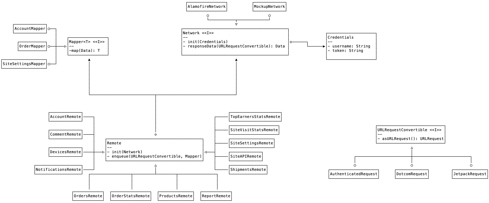

# Networking
> This module encapsulates the implementation of the network requests, including parsing of results and relevant model objects.  

## High level class diagram

## Remote
A `Remote` performs network requests. This is the core of this module.  

The base implementation of `Remote`  is provided an implementation of the `Network` protocol, and enqueues pairs of `Request` and `Mapper`, executing that request on the provided `Network` and delegating the parsing of the response to the `Mapper` provided. 

There is a subclass of `Remote` for each relevant concern. Each of these subclasses provide public methods for each of the networking operations relevant to that concern.

At the time of writing this document, these are the subclasses of `Remote`:
* `AccountRemote`.  Provides methods to load an account, load sites, and load a site plan
* `CommentRemote`. Provides an api  to moderate a comment.
* `DevicesRemote`. Provides api to register and deregister a device
* `Notificationsremote`.  API to load notes, hashes, and update read status and last seen
* `OrdersRemote`. Load all orders, an individual order, notes associated to an order, update an order status, and search orders
* `OrderStatsRemote`. Loads stats associated to an order
* `OrderStatsRemoteV4`. Loads stats associated to an order, provided by the V4 API.
* `ProductsRemote`Loads all Products and a single Product
* `ReportRemote`. Loads an order totals report and all known order statuses
* `ShipmentsRemote` All things Shipment Tracking, from tracking providers to actual tracking associated to an order
* `SiteAPIRemote` Loads the API information associated to a site.
* `SiteSettingsRemote` Loads a site’s settings
* `SiteVisitStatsremote` fetches visitor stats for a given site
* `TopEarnersStatsRemote`fetches the top earner stats for a given site.

## Network
A protocol that abstracts the networking stack. 

There are two implementations of this protocol: `AlamofireNetwork` which manages a networking stack based on the third party library [Alamofire](https://github.com/Alamofire), and `MockupNetwork` which is a mock networking stack that does not actually hit the network, to be used in the unit tests.

## URLRequestConvertible
A protocol the abstracts the actual URL requests. 

At the moment, we provide three implementations of `URLRequestConvertible`:
* `DotcomRequest` models requests to WordPress.com
* `JetpackRequest` represents a Jetpack-Tunneled WordPress.com 
* `AuthenticatedRequest` Wraps up a URLRequestConvertible Instance, and injects credentials (username and token) when required

## Mapper
A protocol that abstracts the different parsers.

There are several implementations of this protocol, roughly one per Remote, although in some cases there is more than one implementation per remote (roughly, one for a single model object, and another for a collection of the same model object). 

Mappers receive an instance of `Data` and return  the result of parsing that data as a model object or a collection of model objects.

## Model objects
Model objects declared in `Networking` are immutable, and modelled as value types (structs) that typically implement `Decodable`

Model objects should implement `Comparable` .

## Unit tests
As mentioned previously, there is an implementation of the `Network` protocol called `MockupNetwork` used to mock network requests in the unit tests. This way we prevent the tests from hitting the actual network.

`MockupNetwork` stubs responses (in the form of  the name of a json file) for a given endpoint. Those stubs can be either stored in a FIFO queue, used once and then removed from the queue, or stored to be reused multiple times, according to a value passed as a parameter of this class’ constructor.

Also, `MockupNetwork` can stub an error as responde for a given endpoint.
